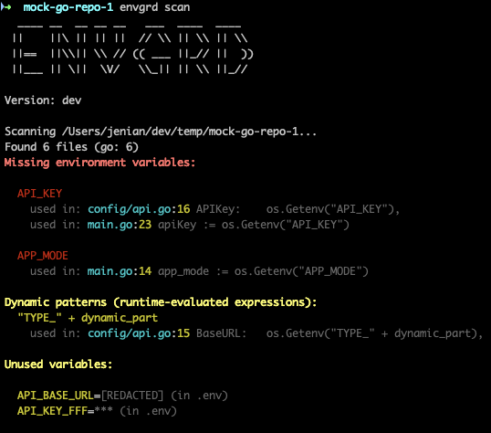

# Envgrd

<div align="center">
 Avoid environment variable drift between your code and configuration files

</div>

<br>

<div align="center">



</div>


### Why use envgrd?

Environment variable drift happens when code and configuration get out of sync - teammates add new variables without updating configs, refactoring leaves orphaned variables, or onboarding misses undocumented requirements. These issues cause runtime failures and deployment headaches.

Envgrd uses Tree-Sitter AST analysis to accurately detect environment variable usage across your codebase and compare it with your configuration files. Unlike regex-based tools, AST parsing understands code structure, handles edge cases correctly, and supports dynamic patterns with fewer false positives.

**💡 Tip**: Automate drift detection by using `envgrd` as a post-merge git hook to catch issues automatically after pulling code.

## Features

- Detects missing environment variables (used in code but not found in any config files or exported environment)
- Detects unused environment variables (in config files but not used in code)
- [Multiple language support](#supported-languages): JavaScript, TypeScript, Go, Python, Rust, Java
- **[Multi-format environment detection](#environment-variable-sources)**: Automatically discovers and reads from `.env` files, `.envrc` (direnv), `docker-compose.yml`, Kubernetes ConfigMaps/Secrets, systemd service files, and shell scripts
- **[Shell environment integration](#environment-variable-sources)**: Reads exported environment variables from your shell (e.g., `export VAR=value`), preventing false positives for variables set via CI/CD, secret managers, or shell exports
- **[Dynamic pattern detection](#dynamic-expression-matching)**: Identifies runtime-evaluated expressions like `process.env["prefix_" + var]` and `os.Getenv(key + "_suffix")` that cannot be fully determined at static analysis time
- [Supports multiple output formats](#usage) (human-readable, JSON)
- **[Configurable ignore rules](#configuration)**: Ignore specific variables or folders via `.envgrd.config` to reduce false positives
- Lightning-fast parallel processing

## Installation

### Quick Install (Recommended)

**Linux/macOS:**
```bash
curl -sSL https://raw.githubusercontent.com/njenia/envgrd/main/install.sh | bash
```

**Windows (PowerShell):**
```powershell
Invoke-WebRequest -UseBasicParsing https://raw.githubusercontent.com/njenia/envgrd/main/install.ps1 | Invoke-Expression
```

### Manual Install

**Linux (amd64):**
```bash
curl -L https://github.com/njenia/envgrd/releases/latest/download/envgrd-linux-amd64.tar.gz | tar -xz && sudo mv envgrd /usr/local/bin/
```

**macOS (amd64 / Intel):**
```bash
curl -L https://github.com/njenia/envgrd/releases/latest/download/envgrd-darwin-amd64.tar.gz | tar -xz && sudo mv envgrd /usr/local/bin/
```

**macOS (arm64 / Apple Silicon):**
```bash
curl -L https://github.com/njenia/envgrd/releases/latest/download/envgrd-darwin-arm64.tar.gz | tar -xz && sudo mv envgrd /usr/local/bin/
```

**Windows:**
```powershell
# Option 1: Use install script (recommended)
Invoke-WebRequest -UseBasicParsing https://raw.githubusercontent.com/njenia/envgrd/main/install.ps1 | Invoke-Expression

# Option 2: Manual installation
# Download and extract
Invoke-WebRequest -Uri https://github.com/njenia/envgrd/releases/latest/download/envgrd-windows-amd64.zip -OutFile envgrd.zip
Expand-Archive envgrd.zip
# Move envgrd.exe to a directory in your PATH (e.g., C:\Program Files\envgrd\)
```

**Linux (arm64):**

Pre-built binaries for ARM64 Linux are not available due to CGO cross-compilation requirements. Please build from source:

```bash
git clone https://github.com/njenia/envgrd.git
cd envgrd
make build
# Binary will be in bin/envgrd
```

### From Source

```bash
# Clone the repository
git clone https://github.com/njenia/envgrd.git
cd envgrd

# Build with Make (automatically detects version from git tags)
make build

# Or install directly
make install
```

### Using Go Install

```bash
go install github.com/njenia/envgrd/cmd/envgrd@latest
```

**Note**: When building locally, use `make build` to automatically set the version from git tags. Building with `go build` directly will show version as "dev".

## Usage {#usage}

### Basic scan

```bash
# Scan current dir recursively
envgrd scan
```

### Scan specific directory

```bash
envgrd scan ./path/to/codebase
```

### Initialize configuration file

Create a `.envgrd.config` file in the current directory:

```bash
envgrd init-config
```

This creates a template configuration file that you can customize to ignore specific variables or folders.

### Use custom env file

```bash
envgrd scan --env-file .env.production
```

### JSON output

```bash
envgrd scan --json
```

### Skip unused variables

```bash
envgrd scan --skip-unused
```

### Disable dynamic pattern detection

By default, `envgrd` detects and reports both static and dynamic environment variable patterns. To disable dynamic pattern detection and only report static patterns (string literals), use the `--no-dynamic` flag:

```bash
envgrd scan --no-dynamic
```

See the [Dynamic Expression Matching](#dynamic-expression-matching) section for more details.

### Silent mode (exit code only)

```bash
envgrd scan --silent
```

## Supported Languages {#supported-languages}

All languages support both static (string literal) and dynamic (runtime-evaluated) environment variable patterns:

- **JavaScript / TypeScript**: `process.env.KEY`, `process.env["KEY"]`, `process.env["prefix_" + var]`, `process.env[var]`
- **Go**: `os.Getenv("KEY")`, `os.Getenv("prefix_" + var)`, `os.Getenv(var)`
- **Python**: `os.environ["KEY"]`, `os.getenv("KEY")`, `os.environ["prefix_" + var]`, `os.getenv(var)`
- **Rust**: `env::var("KEY")`, `std::env::var("KEY")`, `env::var_os("KEY")`, `std::env::var_os("KEY")`, plus dynamic patterns
- **Java**: `System.getenv("KEY")`, `System.getenv().get("KEY")`, plus dynamic patterns

### Dynamic Expression Matching

By default, `envgrd` detects both static and dynamic environment variable patterns:

- **Static patterns**: String literals like `process.env.API_KEY` or `os.Getenv("DATABASE_URL")` where the variable name is known at compile time
- **Dynamic patterns**: Runtime-evaluated expressions like:
  - `process.env["prefix_" + var]` - concatenation with variables
  - `os.Getenv(key + "_suffix")` - string concatenation
  - `env::var(my_var)` - variable references where the env var name is determined at runtime

Dynamic patterns are reported in a separate "Dynamic patterns" section since the exact environment variable name cannot be determined statically. Use the `--no-dynamic` flag to disable dynamic pattern detection and only report static patterns.

## Configuration {#configuration}

### .envgrd.config

Create a `.envgrd.config` file in your project root to configure ignore rules:

```yaml
ignores:
  # Variables that are configured in custom ways (not in .env files or standard configs)
  # These will not be reported as missing
  missing:
    - CUSTOM_API_KEY
    - EXTERNAL_SERVICE_TOKEN
    # Variables configured via custom tools/scripts
  
  # Folders to ignore when scanning (useful for config directories that aren't actual code)
  folders:
    - config
    - configs
    - k8s
    - kubernetes
    - deployments
    # Add more folder names here as needed
```

- **`ignores.missing`**: Variables listed here will not be reported as missing, even if they're not found in any environment files. The tool will show a count of ignored variables in the output.
- **`ignores.folders`**: Folders listed here will be excluded from scanning. This is useful for configuration directories (like Kubernetes manifests, deployment configs) that contain environment variable references but aren't actual running code.

## Environment Variable Sources {#environment-variable-sources}

`envgrd` automatically detects and reads environment variables from multiple sources:

### Configuration Files (Auto-Detected)

The tool automatically scans for and parses the following file formats:

- **`.env` files**: Standard format (`KEY=value`)
- **`.env.*` files**: Environment-specific files (`.env.development`, `.env.production`, `.env.local`, etc.)
- **`.envrc` files**: direnv format (`export VAR=value`)
- **`docker-compose.yml`**: Environment sections in Docker Compose files
- **Kubernetes ConfigMaps and Secrets**: YAML files containing `data:` sections (secrets are automatically base64-decoded)
- **systemd `.service` files**: Files with `Environment=` directives
- **Shell scripts**: `.sh` and `.bash` files containing `export VAR=value` statements

### Exported Shell Environment Variables

In addition to configuration files, `envgrd` also reads variables exported to your shell environment (via `export VAR=value` or set in your shell profile). This is particularly useful for:

- **CI/CD pipelines**: Variables set in GitHub Actions, GitLab CI, Jenkins, etc.
- **Secret management tools**: Variables injected by Doppler, HashiCorp Vault, AWS Secrets Manager, etc.
- **Local development**: Variables exported in your shell session or `.bashrc`/`.zshrc`

**Note**: When the same variable exists in both a config file and the exported environment, the config file value takes precedence. Exported environment variables are marked as `[from environment]` in the analysis and are used to prevent false positives for missing variables, but are not included in the "unused variables" report (only variables from config files are checked for unused status).

## License

MIT

